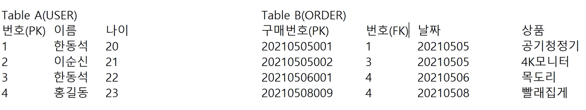

# Day 05 테이블과 제약조건

cmd 창에서도 table을 불러올 수 있다.
`sqlplus hr/hr`
`SELECT * FROM EMPLOYEES;`
~~이렇게 하면 쭉 나오는게 그닥 보기 좋진 않네..~~

## RDBMS (관계형 데이터베이스 관리 시스템)
table이 두개있을때 서로 관계를 맺고 있을 수 있다.

ex

Table B에서 번호를보고 이름 나이를 알고 싶으면, 번호를 가져와 이 번호로 조건으로 가져와 Table A에서 조회한다. 

이러한 구조를 가지는 것을 **Table , Relation(오라클), Class** 라고 부른다

- COLUMN(열, 속성, 필드)
    
    공통된 값들의 주제
- ROW(행, 레코드, 튜플)

    하나의 정보

## Keys
- **Primary Key**
    
    고유한 값 (각 행의 구분점으로 사용)

    *하나의 테이블에서 중복이없고, NULL도 안되는 걸 PK 라고 부른다.*

    ex) table B에서는 구매번호 col을 PK로 하는게 좋다.

    - **NULL** : 아직 어떤 값을 넣을지 모르겠다 라는 뜻을 가진 값

- **Foreign Key**
    
    다른 테이블의 PK를 의미한다.

    보통 테이블끼리 관계를 맺을 때 사용된다.
    
    중복이 가능하다. 

    Table A에 없는 값을 Table B의 FK에 사용할 수 없다. (A에있는 열을 참조하여 사용하는 거니까..)

- **Unique Key**

    NULL은 허용하지만 중복을 허용하지 않는 Key

    아이디 같은걸 pk로 주긴 애매함. 그때 UK로 준다.
