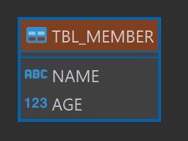
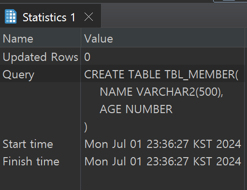

# Day 04 IDE DBeaver와 Oracle DBMS 연동

## SQL 문
- *DDL (Data Definition Language)* : 데이터 정의어
    - 테이블 조작, 제어 관련 쿼리문
    1. `CREATE` : 테이블 생성
    2. `DROP` : 테이블 삭제 (복구X)
    3. `ALTER` : 테이블 수정
        - 테이블명 수정 : `RENAME TO [새로운 테이블명]`
        - 컬럼 추가 : `ADD([새로운 컬럼명] [컬럼 타입])`
        - 컬럼명 변경 : `RENAME COLUMN [생성된 컬럼명] TO [새로운 컬럼명]`
        - 컬럼 삭제 : `DROP COLUMN [생성된 컬럼명]`
    4. `TRUNCATE` : 테이블 내용 전체 삭제 (복구X)
    
## 자료형 (TYPE)
- 숫자 
    - `NUMBER(precision)` : 정수 (소수점 0 생략)
    - `NUMBER(precision,소수점 자리수)` : 실수
    - `NUMBER` : 생략시 22byte 까지 입력 가능 (38자리 정수)
- 문자열
    - `CHAR(길이)` : 고정형 

        CHAR(4)에 'A'를 넣으면 A^^^ 빈 자리가 공백으로 채워짐.

        형식을 정한 날짜, 주민등록번호 처럼 글자 수가 절대 변하지 않는 값을 넣는다.
    - VARCHAR(길이), `VARCHAR2(길이)` : 가변형

        값의 길이 만큼 공간이 배정된다. 글자 수에 변화가 있는 값을 넣는다.
    - `DATE` : FORMAT에 맞춰서 날짜를 저장하는 타입

        "20210101" , "2021-01-01" , "2021-12" <- 난 뭘 받아도 이런 format으로 표현할래~

간단하게 table 하나 만들어보자.
```sql
CREATE TABLE TBL_MEMBER(
	NAME VARCHAR2(500),
	AGE NUMBER
);
``` 

