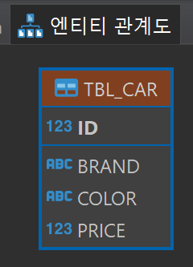
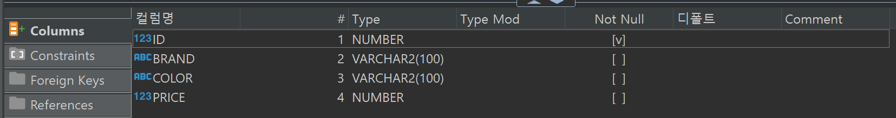
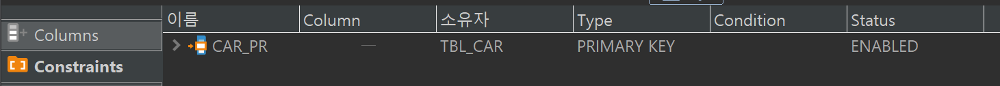

# Day 07 DDL과 제약조건1

- 해당영역 전체화면 : 클릭 후 ctrl + M
- 주석 : `--`
    1. 쿼리문에 설명글 달때
    2. 지금 당장 사용하지 않는 소스코드를 해석하고 싶지 않을때

```sql
--TBL_MEMER 삭제
DROP TABLE TBL_MEMBER ;
```

## 제약조건
테이블을 생성할 떄 특정 컬럼에 조건을 부여하여 들어오는 데이터를 검사한다.

```sql
--자동차 테이블 생성
CREATE TABLE TBL_CAR(
	ID NUMBER,
	BRAND VARCHAR2(100),
	COLOR VARCHAR2(100),
	PRICE NUMBER,
	CONSTRAINT CAR_PK PRIMARY KEY(ID)
);

DROP TABLE TBL_CAR;

--제약 조건 삭제
ALTER TABLE TBL_CAR DROP CONSTRAINT CAR_PK;

--제약 조건 추가
ALTER TABLE TBL_CAR ADD CONSTRAINT CAR_PK PRIMARY KEY(ID);

SELECT  * FROM TBL_CAR;

```




```sql
--동물 테이블 생성 
CREATE TABLE TBL_ANIMAL(
	ID NUMBER PRIMARY KEY,
	"TYPE" VARCHAR2(100), --명령어를 col 명으로 하고싶으면 ""
	AGE NUMBER(3),
	FEED VARCHAR2(100)
);

--기존 제약조건 삭제(PK)
ALTER TABLE TBL_ANIMAL DROP CONSTRAINT SYS_C007005; --제약조건 이름 달라질 수 있으니 매번 확인해 주기.
--제약조건 추가(PK)
ALTER TABLE TBL_ANIMAL ADD CONSTRAINT ANIMAL_PK PRIMARY KEY(ID);

DROP TABLE TBL_ANIMAL ;

SELECT * FROM TBL_ANIMAL;
```