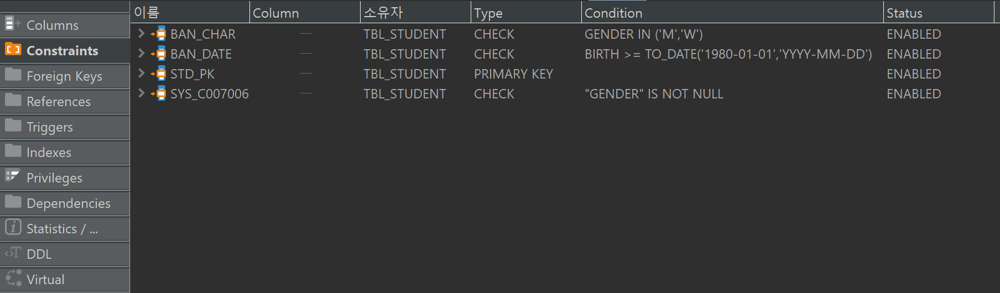

# Day 08 DDL과 제약조건2, 무결성
## 제약조건 DEFAULT 와 CHECK
```sql
--학생 테이블 생성
CREATE TABLE TBL_STUDENT(
	ID NUMBER,
	NAME VARCHAR2(100),
	MAJOR VARCHAR2(100),
	-- GENDER CHAR(1) DEFAULT 'W' NOT NULL CONSTRAINT BAN_CHAR CHECK(GENDER = 'M' OR GENDER = 'W')
	GENDER CHAR(1) DEFAULT 'W' NOT NULL CONSTRAINT BAN_CHAR CHECK(GENDER IN ('M','W')),
	--"W","M"으로만 받을거라서 CHAR 로 1글자로 정하고 "W"와 "M"만 받을 수 있게 제약조건 설정
	BIRTH DATE CONSTRAINT BAN_DATE CHECK(BIRTH >= TO_DATE('1980-01-01','YYYY-MM-DD')),
	CONSTRAINT STD_PK PRIMARY KEY(ID)	
);

INSERT INTO TBL_STUDENT
(ID, NAME, MAJOR, GENDER, BIRTH)
VALUES(1, '한동석', '컴퓨터공학과', 'M' , TO_DATE('1980-01-02','YYYY-MM-DD')); --제약조건에 안맞으면 오류 나옴

SELECT * FROM TBL_STUDENT;

INSERT INTO TBL_STUDENT
(ID,NAME,MAJOR,BIRTH) --GENDER을 넣지않아도 DEFAULT 가 있으니 잘 들어감.
VALUES(3, '홍길동', '전자공학과', TO_DATE('1980-01-02','YYYY-MM-DD')); --제약조건에 안맞으면 오류 나옴

TRUNCATE TABLE TBL_STUDENT;

```


## 무결성
데이터의 정확성, 일관성, 유효성이 유지되는것 -> 허점이 없다.
- 정확성

    데이터는 애매하지 않아야한다. (노르스름하다(?))
- 일관성

    각 사용자가 일관된 데이터를 볼 수 있도록 해야한다.
- 유효성

    데이터가 실제 존재하는 데이터여야 한다.

1. 개체무결성
    
    모든 테이블이 PK로 선택된 컬럼을 가져야한다.

    PK로 선택된 컬럼은 고유한 값을 가져야하며, 빈값, NULL값은 허용하지 않는다.
2. 참조무결성

    두 테이블의 데이터가 항상 일관된 값을 갖도록 유지하는 것
3. 도메인무결성

    column 타입, NULL의 허용 등에 대한 사항을 정의하고, 올바른 데이터가 입력되었는지 확인 하는것