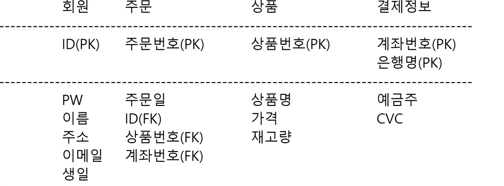

# Day 09 모델링 이론 - 회원, 상품, 주문
## 모델링
추상적인 주제를 DB에 맞게 설계하는 것

1. 요구사항 분석

    회원, 주문, 상품 : 3가지를 관리하고자 한다.

2. 개념적 설계 (개념 모델링)
    

3. 논리적 설계 (논리 모델링)
   

4. 물리적 설계 (물리 모델링)
    ```txt
        USER
        USER_ID : VARCHAR2(100)
        -----------------------
        USER_PW : VARCHAR2(100)
        USER_NAME : VARCHAR2(200)
        USER_ADDRESS : VARCHAR2(300)
        USER_EMAIL : VARCHAR2(300)
        USER_BIRTH : DATE

        PRODUCT
        PRODUCT_NUM : NUMBER
        ----------------------
        PRODUCT_NAME : VARCHAR2(300)
        PRODUCT_PRICE : NUMBER
        PRODUCT_COUNT : NUMBER

        ORDER
        ORDER_NUM : NUMBER
        ----------------------
        ORDER_DATE : DATE
        USER_ID : VARCHAR2(100)
        PRODUCT_NUM : NUMBER
    ```

5. 구현

    요구사항
    - 꽃 테이블과 화분 테이블 2개가 필요
    - 꽃 구매할 때 화분 도 같이 구매한다.
    - 꽃이름과 색깔, 가격이 있다.
    - 화분은 제품 번호, 색깔 , 모양, 꽃 이름이 있다.