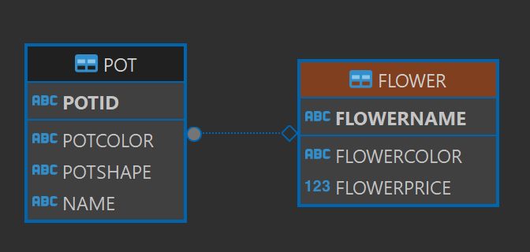

# Day 10 모델링 실습1 - 꽃과 화분
1. 요구분석 
- 꽃 테이블과 화분 테이블 2개가 필요
- 꽃 구매할 때 화분 도 같이 구매한다.
- 꽃이름과 색깔, 가격이 있다.
- 화분은 제품 번호, 색깔 , 모양, 꽃 이름이 있다.

2. 개념적 설계 (개념 모델링)
    ```
    꽃              화분
    --------------------------
    이름            제품번호
    --------------------------
    색깔            색깔
    가격            모양
                    꽃이름
    ```

3. 논리적 설계 (논리 모델링)
    ```
    꽃              화분
    --------------------------
    이름(PK)        제품번호(PK)
    --------------------------
    색깔            색깔
    가격            모양
                    꽃이름(FK)
    ```

4. 물리적 설계 (물리 모델링)
    ```
    FLOWER
    ------
    FLOWER_NAME : VARCHAR2(200)
    COLOR : VARCHAR2(100),
    PRICE : NUMBER
    ---------------------------------
    CONSTRAINT PRIMARY KEY(FLOWER_NAME)


    POT
    ---------
    POT_ID : VARCHAR2(100)
    POT_COLOR : VARCHAR2(200)
    SHAPE : VARCHAR2(2000)
    FLOWER_NAME : VARCHAR2(200)
    ------------------------------------
    CONSTRAINT FOREIGN KEY(FLOWER_NAME) REFERENCES FLOWER(FLOWER_NAME)
    ```

    5. 구현
    ```sql
    
    DROP TABLE FLOWER;
    
    CREATE TABLE FLOWER(
        FLOWERNAME VARCHAR2(200),
        FLOWERCOLOR VARCHAR2(100),
        FLOWERPRICE NUMBER,
        CONSTRAINT FLOWER_PK PRIMARY KEY(FLOWERNAME) --PK이름을 설정할 수 있다.
    );

    SELECT * FROM FLOWER;

    CREATE TABLE POT(
        POTID VARCHAR2(100),
        POTCOLOR VARCHAR2(100),
        POTSHAPE VARCHAR2(200),
        NAME VARCHAR2(200),
        CONSTRAINT POT_PK PRIMARY KEY(POTID),
        CONSTRAINT POT_FK FOREIGN KEY(NAME) REFERENCES FLOWER(FLOWERNAME)
    );
    SELECT * FROM POT;

    ```
    