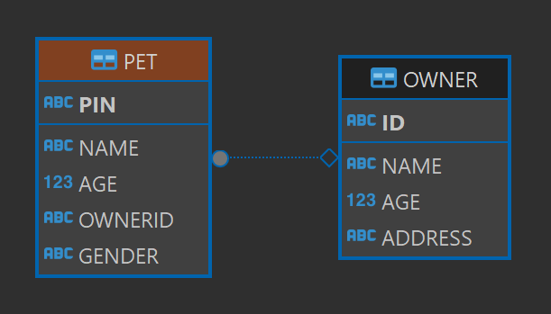

# Day 10 모델링 실습2 - 동물병원, DML의 종류

1. 물리 모델링
    ```
    OWNER
    ID VC2(200)
    ----------
    NAME VC2(200)
    AGE N(5)
    ADDRESS VC2(300)

    PET
    PIN VC2(300)
    ------------
    NAME VC2(200)
    AGE N(5)
    OWNERID VC2(200)
    ```

2. 구현
    ```sql
        DROP TABLE OWNER;

    CREATE TABLE OWNER(
        ID VARCHAR2(200) PRIMARY KEY,
        NAME VARCHAR2(200) NOT NULL,
        AGE NUMBER(5) DEFAULT 20,
        ADDRESS VARCHAR2(300)
    );

    SELECT * FROM OWNER;

    DROP TABLE PET;

    CREATE TABLE PET(
        PIN VARCHAR2(300) PRIMARY KEY,
        NAME VARCHAR2(200) NOT NULL,
        AGE NUMBER(5) DEFAULT 1,
        OWNERID VARCHAR2(200),
        GENDER CHAR(1) DEFAULT 'M' NOT NULL CONSTRAINT CHECK_CHAR CHECK(GENDER IN('M','W')),
        CONSTRAINT PET_FK FOREIGN KEY(OWNERID) REFERENCES OWNER(ID)
    );

    SELECT * FROM PET;
    ```
    

    ## SQL 
    - DDL
    - DML

    ## DML (Data Manipulation Language)
    
    - SELECT : 조회 검색

        SELECT 컬럼1 컬럼2 컬럼3,.. FROM 테이블명
        WHERE 조건식;
        
    - INSERT : 추가

        INSERT INTO 테이블명
        (컬렁명1 , 컬럼명2,...)
        VALUSE(값1, 값2, ...)

        INSERT INTO 테이블명 VALUES(값1, 값2,...)
    - UPDATE : 수정

        UPDATE 테이블명
        SET 기존컬럼명 = 새로운값
        WHERE
    - DELETE : 삭제
        
        DELETE FROM 테이블명
        WHERE 조건식;
        하나 행 삭제하는거임. (TRUNCATE : 전체 삭제)

