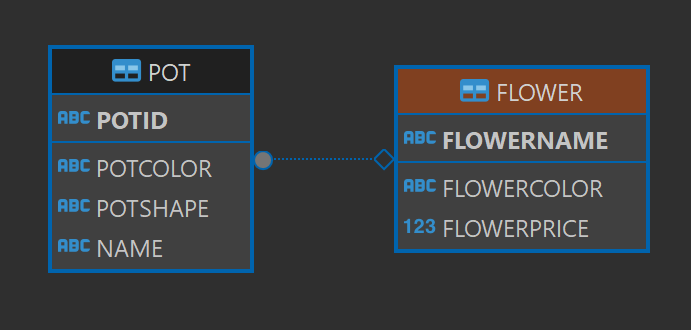

# Day 12 - WHERE 조건식

## DML 종류
- SELECT
- INSERT
- UPDATE
- DELETE

## 조건식 : 참 또는 거짓 둘 중 하나의 결과가 나오는 식
- **WHERE 조건식**
- `>` , `<` : 초과, 미만
- `>=`, `<=` : 이상, 이하
- `=` : 같다
- `<>`,`!=` ,`^=` : 같지 않다.
- AND : 두 조건식 모두 참이면 참
- OR : 둘 중 하나라도 참이면 참

```sql
    --SELECT * FROM FLOWER; 이게 더 느림
    SELECT FLOWERNAME, FLOWERCOLOR, FLOWERPRICE FROM FLOWER;

    -- INSERT 추가 : 부모와 자식 중 부모 테이블에 값을 먼저 추가해야한다.
    INSERT INTO FLOWER
    (FLOWERNAME, FLOWERCOLOR, FLOWERPRICE)
    VALUES('장미','RED',3000);

    INSERT INTO FLOWER
    (FLOWERNAME, FLOWERCOLOR, FLOWERPRICE)
    VALUES('해바라기','YELLOW',5000);

    INSERT INTO FLOWER
    (FLOWERNAME, FLOWERCOLOR, FLOWERPRICE)
    VALUES('할미꽃','WHITE',9000);

    -- DELETE 삭제 : 부모와 자식 중 자식테이블에서 참조하는 값들을 먼저 삭제 해야한다.
    DELETE FROM FLOWER
    WHERE FLOWERNAME = 장미;

    SELECT * FROM POT;

    -- TABLE -> 우클릭 -> SQL -> INSERT -> COPY 해오면됨.. 굳이 외울필요 X
    INSERT INTO POT
    (POTID, POTCOLOR, POTSHAPE, NAME)
    VALUES('20210505001', 'WHITE', '물레방아', '장미'); -- PK에있는 것만 가져올 수 있으니 개나리 이딴거 X

    INSERT INTO POT
    (POTID, POTCOLOR, POTSHAPE, NAME)
    VALUES('20210505002', 'BLACK', '타원형', '해바라기');

    INSERT INTO POT
    (POTID, POTCOLOR, POTSHAPE, NAME)
    VALUES('20210506004', 'RED', '사각형', '할미꽃');


    DELETE FROM POT 
    WHERE NAME = '장미';

    -- UPDATE 수정
    UPDATE POT  -- POT TABLE 에서 색을 WHITE로 수정하겠다. 
    SET POTCOLOR = 'WHITE'  -- 누굴? NAME이 할미꽃이고 POTSHAPE가 타원형인.
    WHERE NAME = '할미꽃' AND POTSHAPE = '타원형'; 
```


- 칠해진 동그라미가 부모임. (부모가 자식에 닿았다를 표현)
- 다이아몬드가 자식임. (자식이 부모에 닿았다)

### DELETE 와 TRUNCATE 차이
- `DELETE` : 복구가 가능 (느려도.. 이게 안전)
- `TRUNCATE` : 복구가 불가능 (절대 쓰지마!)

