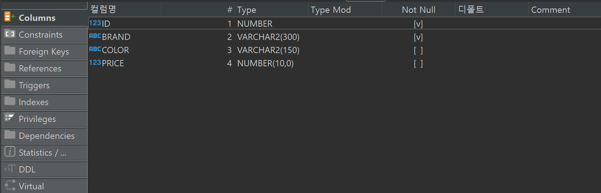
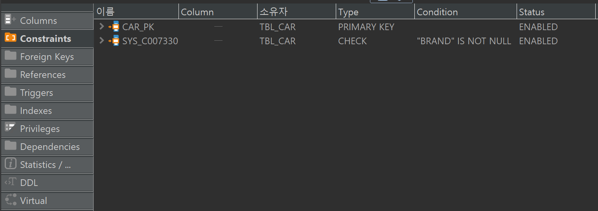

# Day 18 - 정규화 - 이상현상, NULL 이론

## NULL
- 정의되지 않은 값
- 빈 값 대신 미정값을 부여할 때 사용 (PK는 불가능, FK는 가능)

### NOT NULL 제약조건
- `ALTER TABLE 테이블명 MODIFY 컬럼명 NOT NULL;`

    반드시 이렇게 제약조건을 추가해줘야한다.

### 제약조건 삭제
- `ALTER TABLE 테이블명 DROP COMSTARINT 제약조건 이름;`

### 조건식
- `컬럼명 IS NULL` : 컬럼값이 NULL이면 참
- `컬럼명 IS NOT NULL`  : 컬럼값이 NULL이 아니면 참

### NULL 값을 다른값으로 변경
- `NVL()` : NULL 값 대신 다른값으로 변경 후 검색
- `NVL2()` : NULL 일 떄의 값, NULL 아닐때의 값을 각각 설정

```sql
CREATE TABLE TBL_CAR(
	ID NUMBER,
	BRAND VARCHAR2(300),
	COLOR VARCHAR2(150),
	PRICE NUMBER(10),
	CONSTRAINT CAR_PK PRIMARY KEY(ID)
);

ALTER TABLE TBL_CAR MODIFY BRAND NOT NULL;
```



```sql
-- NOT NULL 제약조건 삭제
ALTER TABLE TBL_CAR DROP CONSTRAINT SYS_C007330;
```

```sql
--PLAYER TABLE 에서 POSTION이 NULL/NOT NULL 인 선수 검색
SELECT * FROM PLAYER WHERE PLAYER."POSITION" IS NULL;
SELECT * FROM PLAYER WHERE PLAYER."POSITION" IS NOT NULL;
```