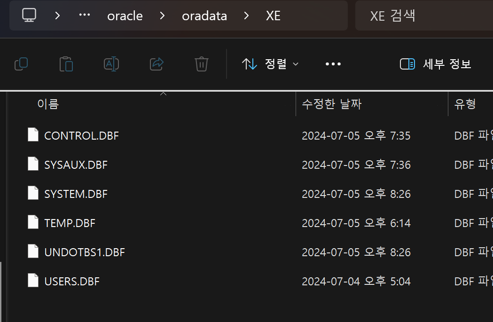
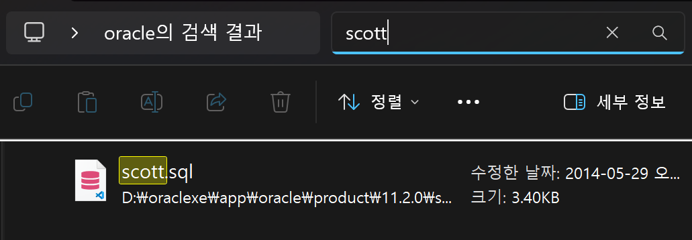
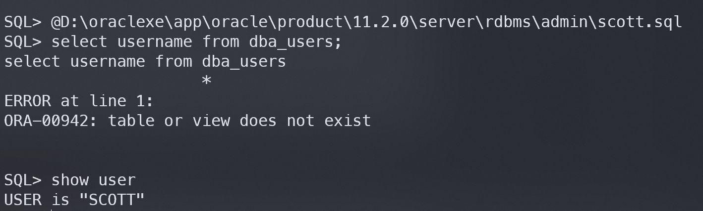
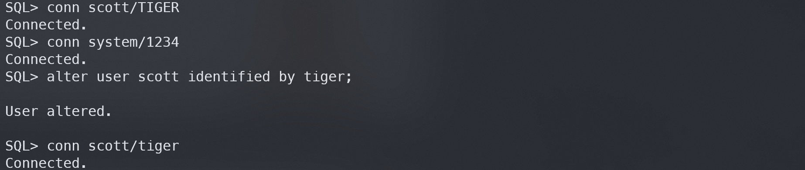
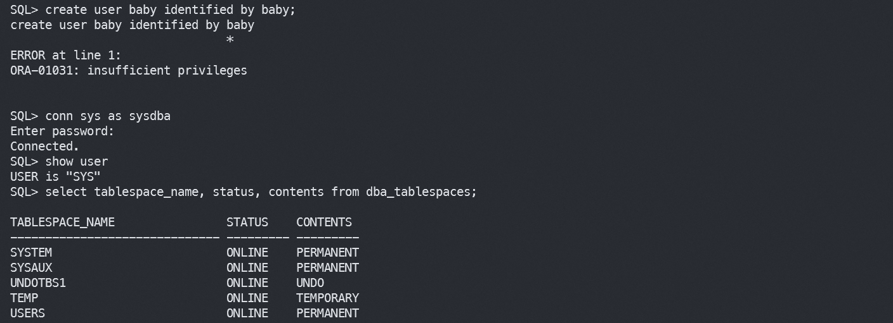
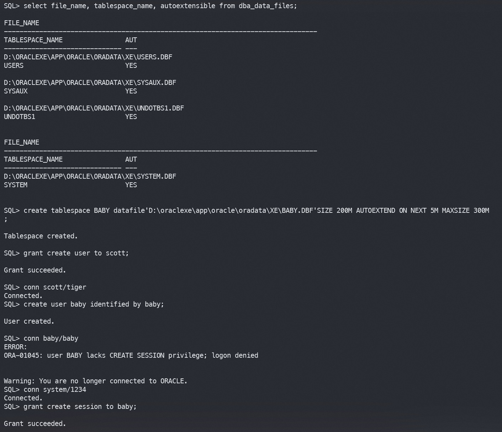
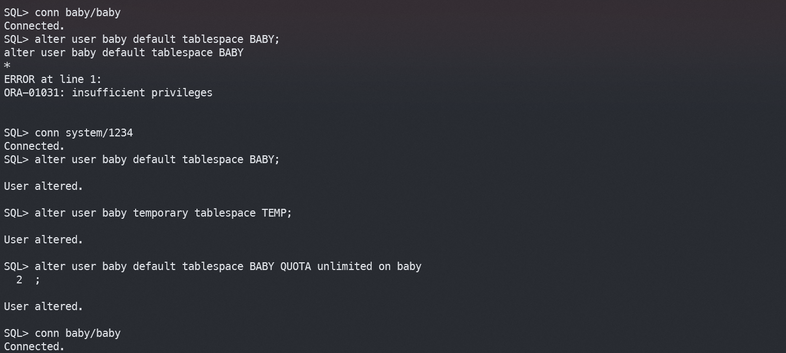
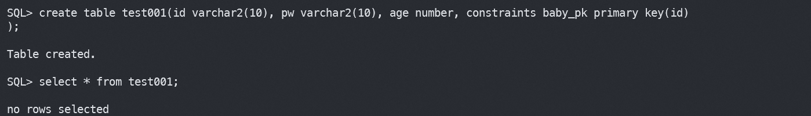
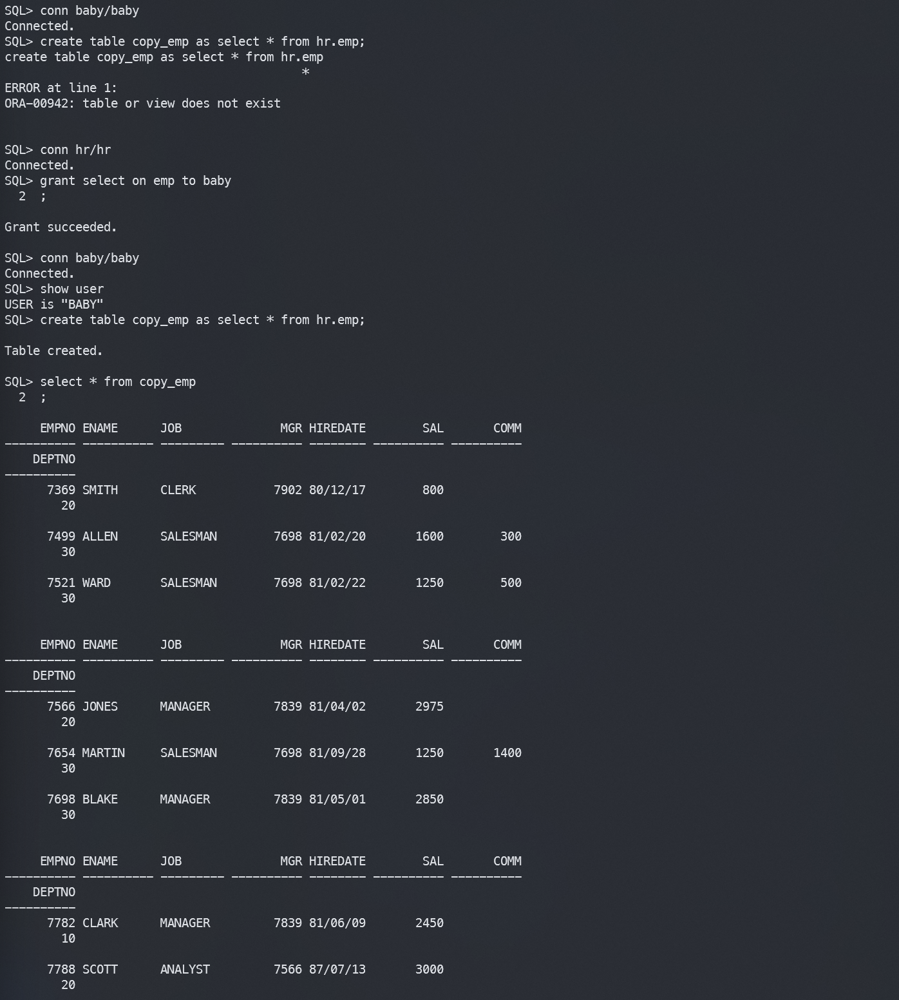
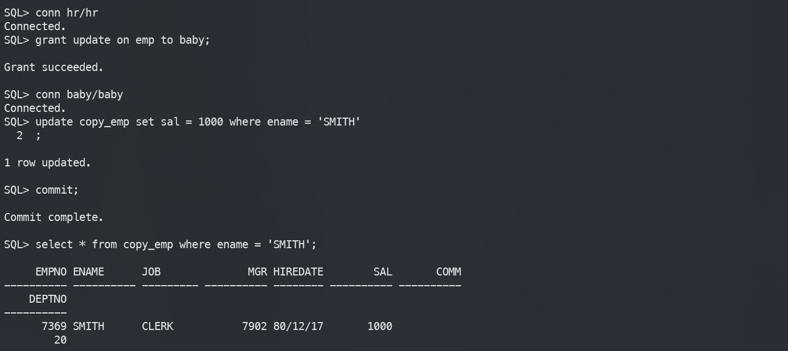

# Day 26 DCL

## DCL (Data Control Language) 데이터 제어어
- `GRANT` : 권한 부여
- `REVOKE` : 권한 강탈
    - scott이라는 계정을 만들고 로그인을 해보자. scott은 아마 이미 있는걸거임.

    
    
    계정을 만들면 계정에 대한 table들을 저장하는 임시저장소들 Database files

    scott을 검색을 해보면 scott.sql이 나온다.
    

    scott.sql 경로를 드래그해서 `SQL> @D:\oraclexe\app\oracle\product\11.2.0\server\rdbms\admin\scott.sql` 해주면 scott에대한 내용들이 전부 기록이됨.

    

    scott에 연결을 해주고 비밀번호를 TIGER 에서 tiger로 바꿔준다.
    

    TABLE SPACE 만들기
    

    TABLE SPACE와 기존 계정 연동하기
    

    

    

    A에서 B로 파일을 주고싶으면 B에서 A로 권한을 줘야한다.
    
    
    
    table을 수정 해보자 !

    

- `ROLL`