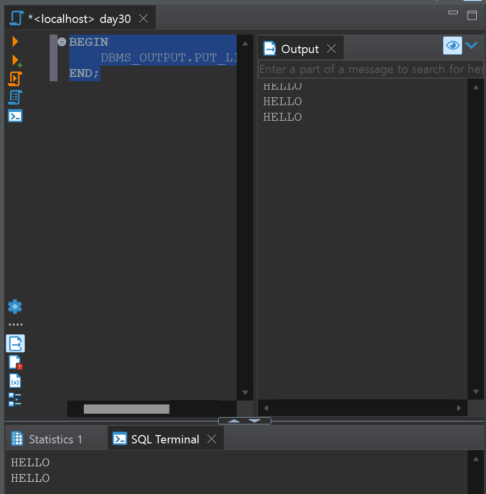

# Day 30 프로시저1 - 기초

## 프로시저 (Procedure) : 함수

### 함수란 : 이름()
f       (x)     =   2x+1

함수명 매개변수     out값(리턴값)

        변수(in값)     
```SQL
CREATE OR REPLACE PROCEDURE [프로시저이름]
(
    매개변수1 IN 데이터타입:=타입,
    매개변수2 IN 데이터타입%TYPE -- 이 데이터 타입의 타입을 매개변수2의 타입으로 쓰겠다 
)
```
## IS : 함수내에서 사용할 변수, 상수 등을 선언
## BEGIN 실행할 문장 END;
## CALL 프로시저이름 (값1, 값2)

cmd 에서 `sqlplus sys as sysdba` `1234` `set serveroutput on`으로 서버에서 출력하는걸 on으로 설정해준다.



BEGIN부터 END까지 전체부분을 드래그해서 ctrl+enter로 실행해주면 output으로 나타나는것을 볼 수 있다.

```SQL
CREATE OR REPLACE PROCEDURE F
(
	X NUMBER 
)
IS 
BEGIN 
	DBMS_OUTPUT.ENABLE;
	DBMS_OUTPUT.PUT_LINE(2*X+1);
END;

CALL F(2);
```
